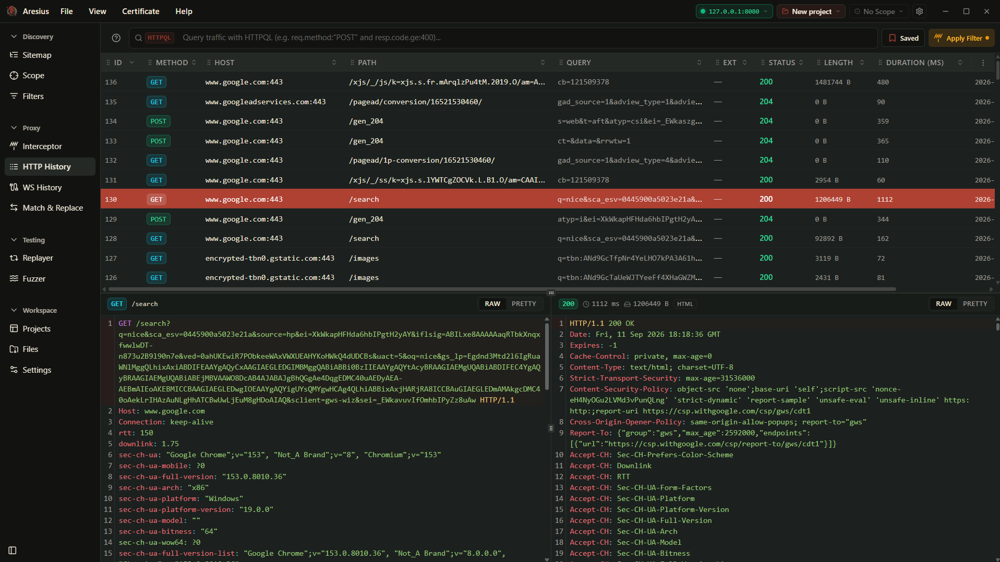

<div align="center">


# Aresius

### The lightweight, native interception proxy for security testing.

**Fast. Cross-platform. Open source.**

<p>
  
  
  
  
  
  
</p>

<p>
  <a href="#-installation"><strong>Install</strong></a> ·
  <a href="#-quick-start"><strong>Quick Start</strong></a> ·
  <a href="#-features"><strong>Features</strong></a> ·
  <a href="#-why-aresius"><strong>Why Aresius</strong></a> ·
  <a href="#-contributing"><strong>Contributing</strong></a> ·
  <a href="../../releases"><strong>Releases</strong></a>
</p>



</div>

<br/>

## ⚡ What is Aresius?

Aresius is a desktop HTTP/HTTPS interception proxy built for people who test
the security of web applications for a living. Point your traffic at it,
inspect and tamper with requests in real time, replay anything you've
captured, and dig into TLS without the memory footprint or license fee of
the tools you're used to.

Built on **Tauri + Rust** instead of Java or Electron — so it starts fast,
stays light, and doesn't eat your RAM during a long engagement.

<br/>

## 🚀 Quick Start

```bash
git clone https://github.com/0xMarik/Aresius.git
cd Aresius
npm install
npm run tauri dev
```

On first launch, Aresius generates a local CA — trust it in your OS or
browser and you're ready to intercept HTTPS traffic.

<br/>

## ✨ Features

| | |
|---|---|
| 🔁 **Request replayer** | Edit and resend captured requests, compare responses side by side |
| 🗂️ **Sessions & collections** | Organize requests the way you organize an engagement |
| 🕓 **Full history** | Browse, filter, and jump back to any past request |
| 🪶 **Native performance** | Rust backend, tiny install size, low idle memory |
| 🖥️ **Cross-platform** | Windows, macOS, Linux — same experience everywhere |

<br/>

## 🥊 Why Aresius

|  | Aresius | Burp Suite | Caido |
|---|:---:|:---:|:---:|
| Open source | ✅ | ❌ | ❌ |
| Native (non-JVM/Electron) | ✅ | ❌ | ✅ |
| Free to use fully | ✅ | Limited (Community) | Limited (free tier) |

<br/>

## 📦 Installation

**Prebuilt binaries** — grab the latest for your OS from
[**Releases**](../../releases).

**Build from source:**

Requirements: [Rust](https://www.rust-lang.org/tools/install) (stable),
[Node.js](https://nodejs.org/), and the
[Tauri prerequisites](https://tauri.app/start/prerequisites/) for your OS.

```bash
git clone https://github.com/0xMarik/Aresius.git
cd Aresius
npm install
npm run tauri build
```

<br/>

## 🛠️ Development

```bash
cargo build          # Rust backend Inside src-tauri
npm run tauri dev    # run in dev mode with hot reload
```

Guidelines for issues and pull requests live in
[**CONTRIBUTING.md**](CONTRIBUTING.md).

<br/>

## 🗺️ Roadmap

- [ ] Plugin ecosystem

Have an idea? [Open a discussion](../../discussions) — this list is shaped
by what the community actually needs.

<br/>

## 🔒 Security

Aresius handles decrypted, potentially sensitive traffic. Found a
vulnerability? Please report it privately rather than filing a public
issue — see [**SECURITY.md**](SECURITY.md).

<br/>

## 🤝 Contributing

Contributions are welcome — bug reports, features, docs, or just opening an
issue to discuss an idea. Start with
[**CONTRIBUTING.md**](CONTRIBUTING.md) and check
[**good first issues**](../../issues?q=is%3Aissue+is%3Aopen+label%3A%22good+first+issue%22).

<br/>

## 📄 License

Aresius is licensed under the **GNU Affero General Public License v3.0**.
See [**LICENSE**](LICENSE) for the full text.

In short: use it, modify it, run it as a service — just keep it open under
the same license.

<br/>

<div align="center">

**Built with [Tauri](https://tauri.app/) · [Rust](https://www.rust-lang.org/) · [React](https://react.dev/)**

If Aresius is useful to you, consider ⭐️ starring the repo — it helps more than you'd think.

</div>
